# Bases de datos futuras: índice

> **Estado: solo documentación.** Nada de esto está implementado. Hoy la base (Neon) solo tiene `programas` y `programa_versiones` (ver [DB-SETUP.md](../../_futuro/nube-neon/DB-SETUP.md), backend archivado para la Versión 2). Estos documentos proponen cómo pasar a la base las planillas del grupo, sin copiar datos reales.

| Documento | Fuente | Contenido |
|---|---|---|
| [01-jovenes.md](01-jovenes.md) | Planilla de Admisión Jóvenes 2026 | Campos celda por celda, esquema de personas, jóvenes, representantes, ficha médica, unidades/subgrupos y progresión; protección de datos de menores |
| [02-adultos.md](02-adultos.md) | Planilla de Admisión Adultos 2026 | Campos, cargos, formación, acuerdo mutuo, referencias; protección |
| [03-informe-previo-ip.md](03-informe-previo-ip.md) | Informe Previo (V LSG feb 2026) + IP Waingunga | Campos del IP, qué sale del programa y qué se pide aparte, IP grupal vs. por unidad, relación con jóvenes y adultos, formato de salida |
| [../indicadores-de-logro.md](../indicadores-de-logro.md) | IP Waingunga (hojas I.L.) | I.L. oficiales de Manada, Tropa y Clan (ya cargados en la plantilla) |

## Diagrama entidad-relación

```mermaid
erDiagram
    %% ── Existente ──
    programas ||--o{ programa_versiones : "tiene versiones"

    %% ── Personas ──
    personas ||--o| jovenes : "es"
    personas ||--o| adultos : "es"
    jovenes ||--o{ joven_responsables : "tiene"
    personas ||--o{ joven_responsables : "es responsable de"
    personas ||--o{ fichas_medicas : "una por año"
    personas ||--o{ inscripciones : "una por año"
    personas ||--o{ autorizaciones : "recibe / otorga"
    personas ||--o{ historial_scout_previo : "trayectoria previa"
    personas ||--o{ distinciones : "recibe"
    personas ||--o{ participaciones : "CIP, cursos, noches, horas"
    personas ||--o{ habilidades : "domina"
    personas ||--o{ representante_colaboracion : "ofrece"

    %% ── Estructura del grupo ──
    unidades ||--o{ subgrupos : "seisenas / patrullas / equipos"
    jovenes ||--o{ joven_unidad : "pertenece (historial)"
    unidades ||--o{ joven_unidad : ""
    subgrupos |o--o{ joven_unidad : ""

    %% ── Progresión ──
    adelantos ||--o{ progresion : ""
    jovenes ||--o{ progresion : "obtiene"
    jovenes ||--o{ especialidades : "obtiene"

    %% ── Adultos ──
    adultos ||--o{ adulto_cargos : "ejerce"
    cargos ||--o{ adulto_cargos : ""
    unidades |o--o{ adulto_cargos : ""
    cargos ||--o{ cargo_items : "funciones, actividades, metas…"
    adultos ||--o{ adulto_formacion : "recibe"
    cursos ||--o{ adulto_formacion : ""
    adultos ||--o{ adulto_referencias : "da"
    adultos ||--o{ acuerdos_mutuos : "firma cada año"
    acuerdos_mutuos ||--o{ acuerdo_items : ""
    cargo_items ||--o{ acuerdo_items : ""

    %% ── Informe Previo ──
    programa_versiones |o--o{ informes_previos : "se genera desde"
    informes_previos ||--o{ ip_lugares : ""
    informes_previos ||--o{ ip_contactos : ""
    informes_previos ||--o{ ip_indicadores : "I.L. elegidos"
    informes_previos ||--o{ ip_adultos : "staff / invitados"
    personas |o--o{ ip_adultos : ""
    informes_previos ||--o{ ip_asistentes : "participantes"
    jovenes ||--o{ ip_asistentes : ""
    autorizaciones |o--o{ ip_asistentes : "autorización de la actividad"
    informes_previos |o--o{ participaciones : "al realizarse"

    programas {
        uuid id PK
        text rama
        text titulo
        date fecha
    }
    programa_versiones {
        uuid id PK
        uuid programa_id FK
        int version
        jsonb contenido
    }
    personas {
        uuid id PK
        text cedula "cifrada + hash"
        text nombre1
        text apellido1
        date fecha_nacimiento
    }
    jovenes {
        uuid persona_id PK
        text escolaridad
        date fecha_promesa
    }
    adultos {
        uuid persona_id PK
        date fecha_ingreso_adulto
    }
    fichas_medicas {
        int id PK
        uuid persona_id FK
        int anio
        jsonb alergias "cifrado"
    }
    unidades {
        int id PK
        text rama
        text nombre
    }
    informes_previos {
        uuid id PK
        uuid programa_version_id FK
        text formato "grupo | evento"
        text alcance "unidad | grupal"
        text_array ramas
    }
```

## Orden sugerido de implementación

Cada paso sirve por sí solo y prepara el siguiente:

1. **Catálogos y estructura** (`catalogo`, `adelantos`, `unidades`, `subgrupos`, `cargos`, `cursos`). Solo son listas; no tienen datos sensibles, así que es el mejor lugar para empezar a probar la base.
2. **Cuentas y roles de dirigentes**: autenticación individual, rol y unidad asignada, más la tabla de auditoría. **Tiene que estar antes de cargar datos personales**: las claves compartidas actuales no alcanzan (ver [01 › Protección](01-jovenes.md#datos-sensibles-de-menores-y-cómo-protegerlos)).
3. **Adultos** (`personas` + `adultos` + `adulto_cargos` + `adulto_formacion`). Son pocos y se necesitan como responsables en programas e IP. Arrancar con la **autocarga** de cada adulto (su propia ficha).
4. **Jóvenes y representantes** (`jovenes`, `joven_responsables`, `joven_unidad`, `inscripciones`, `autorizaciones`), con cifrado por columna desde el primer día.
5. **Fichas médicas** (anuales, cifradas, con retención automática) y el **resumen de salud** para actividades.
6. **Progresión** (`progresion`, `especialidades`, `distinciones`, `participaciones`, `habilidades`). Se puede cargar de a poco desde el «Historial de progresión» de las planillas.
7. **Informe Previo desde un programa**: primero solo con los campos **P** y **M** (sin participantes) y la salida `.xlsx`; después, participantes, autorizaciones y el checklist.
8. **Acuerdo mutuo** e inscripciones a eventos (formato de evento: inscripción de joven, adulto, patrulla y manada).

## Reglas generales

- **Nunca** hay datos reales en el repositorio (ni en seeds, ni en pruebas, ni en capturas). Para desarrollar se usan datos sintéticos.
- Las plantillas `.xlsx` oficiales se guardan en almacenamiento privado, **después de vaciarlas** (hoy traen datos reales).
- Las fichas individuales, como el ejemplo de mapeo de una planilla de adulto llenada, se guardan **fuera** del repositorio.
